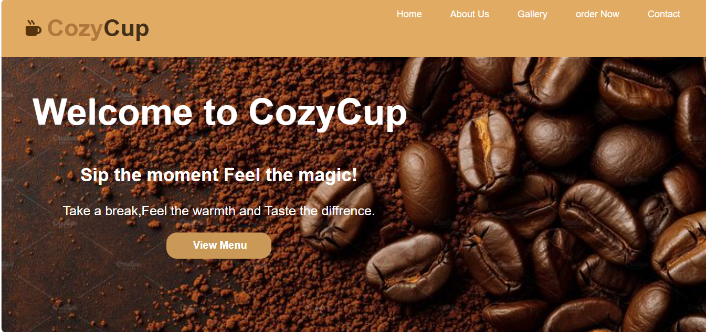
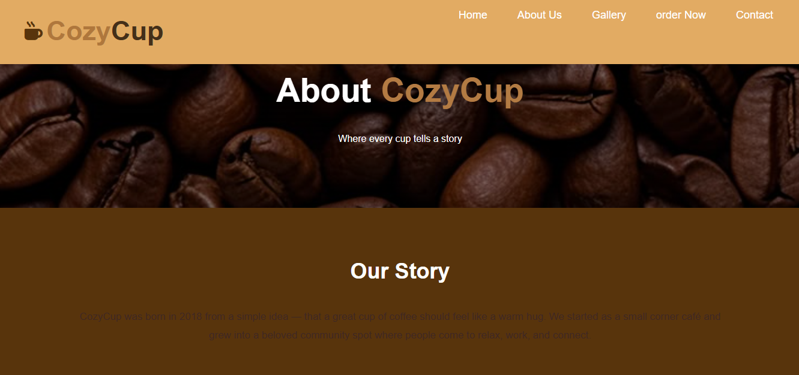
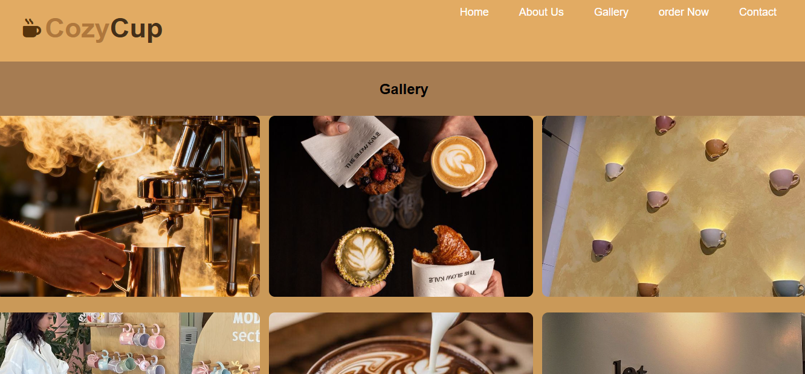
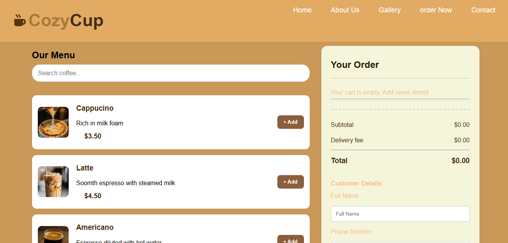
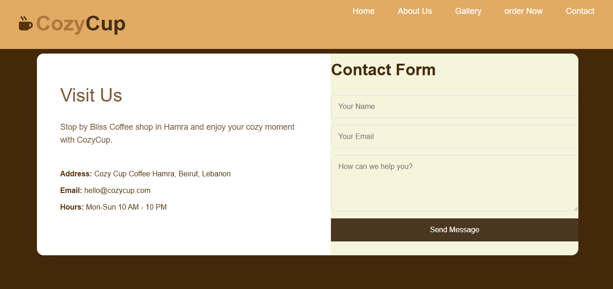

# CozyCup Coffee Shop ☕

## Description
CozyCup is a fully responsive React web application for a coffee shop. Customers can browse menus, place orders, view galleries, and contact the shop.

## Features
- 📱 Fully responsive (mobile, tablet, desktop)
- ☕ Interactive order page with cart
- 🔍 Menu filtering and search
- 📸 Photo gallery
- 💬 Contact form with validation
- 👥 About page

## Technologies
- React 18
- React Router v6
- Vite
- CSS3

## Pages
1. Home - Hero, categories, contact
2. Menu - Coffee menu with prices
3. Order - Shopping cart system
4. Gallery - Photo gallery
5. About - Company info

## How to Run
```bash
npm install
npm run dev
```

## GitHub Repository
https://github.com/12232536-png/cozycup

## Author
Date: May 2026


## screenshots

### Home Page







